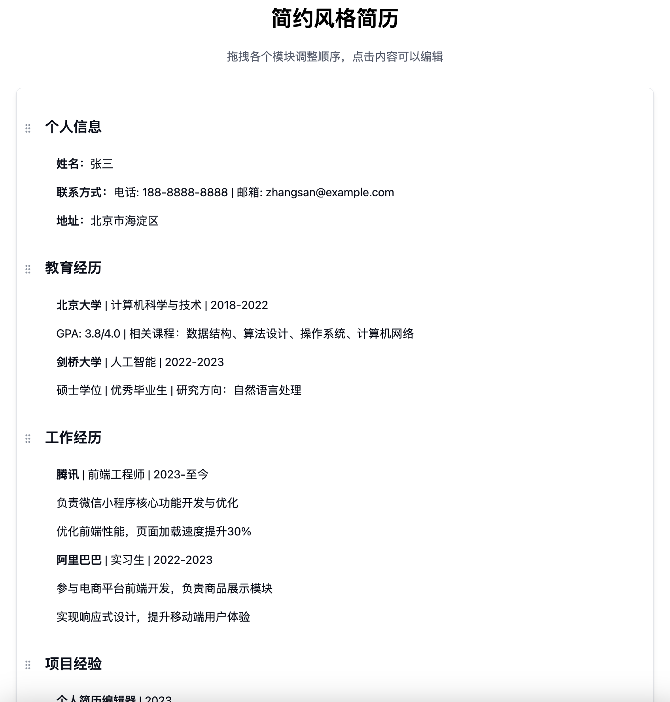

# Notion Style Resume Editor

A Notion-style resume editor built with Next.js, React, TipTap, and styled with Tailwind CSS.



## Features

- Interactive resume editing with block-based components
- Rich text editing capabilities using TipTap
- Different block types (headings, paragraphs)
- Layout options (horizontal, vertical)
- Modern UI with hover interactions and animations
- Fully responsive design

## Getting Started

Follow these steps to run the project locally:

1. Install dependencies:
```bash
npm install
# or
yarn install
# or
pnpm install
```

2. Start the development server:
```bash
npm run dev
# or
yarn dev
# or
pnpm dev
```

3. Open [http://localhost:3000](http://localhost:3000) with your browser to see the result.

## Technologies Used

- Next.js
- React
- TipTap Rich Text Editor
- Radix UI
- Framer Motion
- Tailwind CSS

## Project Structure

- `src/app` - Next.js app router files
- `src/components/editor` - Resume editor components
  - `ResumeEditor.js` - Main editor component with state management
  - `ResumeBlock.js` - Individual editable block component


# 模板1：简约风格简历（Simple Theme Resume）

## 概述

这是一个基于拖拽功能的简约风格简历编辑器。用户可以通过拖拽调整各个模块的顺序，并且可以直接点击内容进行编辑。

## 特点

- **实时编辑**：点击任何文本区域可以直接编辑内容
- **拖拽排序**：拖拽各个模块的头部可以调整整个模块的顺序
- **丰富格式**：支持文本格式化（粗体、斜体、下划线等）
- **预设模块**：包含个人信息、教育经历、工作经验、项目经验、技能专长和校园经历等常用模块

## 如何使用

1. 访问 `/simple-theme` 路由查看简约风格的简历模板
2. 点击任何文本区域可以直接编辑内容
3. 将鼠标悬停在文本上会显示格式化选项（粗体、斜体、下划线）
4. 拖拽模块左侧的手柄可以调整整个模块的顺序

## 技术实现

基于 React 和以下核心库：
- dnd-kit：提供拖拽功能
- @tiptap/react：提供富文本编辑功能
- framer-motion：提供动画效果
- Tailwind CSS：提供样式

## 未来计划

- 添加更多主题样式
- 支持导出为 PDF
- 提供更多格式化选项
- 实现模板保存和加载功能


## License

MIT
